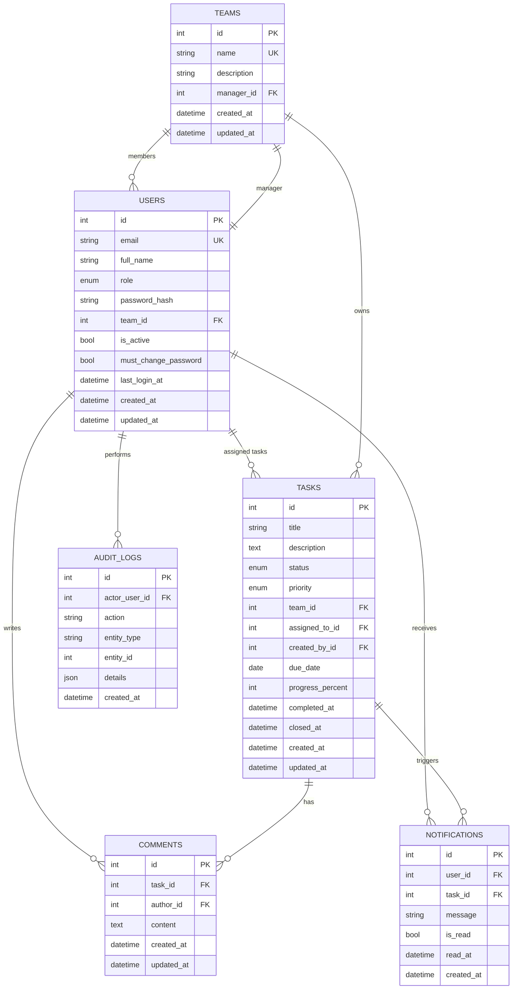

# Phase 0: System Design and Architecture

## 1. Goal of this phase

Define the production-minded architecture for an internal company Task Management System before writing implementation code. This phase establishes the domain model, request flow, security model, folder structure, dashboards, deployment assumptions, and build roadmap so later phases stay clean and consistent.

## 2. Why this phase matters in the system design

If we skip design and start coding immediately, the most common problems are:

- business rules getting mixed into routes and templates
- authorization being enforced only in the UI instead of the backend
- hard-to-change database relationships
- weak authentication design
- unclear boundaries between admin, manager, and employee features
- inconsistent behavior between local development and production deployment

This phase reduces those risks by deciding the architecture first.

## 3. Files/folders we will create or edit

- `docs/PHASE_0_SYSTEM_DESIGN.md` - architecture and implementation blueprint for the whole project

## 4. Exact terminal commands to run

No application runtime commands are required in Phase 0 because we are intentionally not writing or running app code yet.

If you want to inspect the repo locally after this phase:

```bash
ls
ls docs
```

## 5. Full code for each file

### File path: `docs/PHASE_0_SYSTEM_DESIGN.md`

This file is the full Phase 0 deliverable.

## 6. Explanation of the design

### What we are building

We are building an internal browser-based Task Management System for employees inside a company network. It is not a public SaaS product. The expected deployment style is:

- app hosted on an internal company server
- reachable by employees on the same network
- accessed through a browser using an internal URL such as `http://192.168.x.x:8000`

The system manages:

- company users
- teams
- tasks
- comments
- notifications
- audit logs

### Who the users are

#### Admin

Admin is the system operator. Admin manages users, teams, assignments, visibility across the system, reports, and audit logs.

#### Manager

Manager is the team lead. Manager creates and manages tasks only for employees inside the manager's own team.

#### Employee

Employee is the assignee. Employee works only on tasks assigned to them and can update progress, comment, and mark tasks completed.

### Role capability summary

| Capability | Admin | Manager | Employee |
|---|---|---|---|
| Create users | Yes | No | No |
| Edit users | Yes | No | No |
| Deactivate users | Yes | No | No |
| Create teams | Yes | No | No |
| Assign team manager | Yes | No | No |
| Assign team employees | Yes | No | No |
| Create tasks | Yes | Yes | No |
| Assign tasks | Yes | Yes, own team only | No |
| Update any task | Yes | Own team tasks | Own assigned tasks only |
| Close tasks | Yes | Yes | No by default |
| View all tasks | Yes | Own team only | Own assigned only |
| View audit logs | Yes | No | No |
| View notifications | Yes | Yes | Yes |

### Why clean architecture is being used

Clean architecture helps because this project has real business rules:

- a manager cannot assign tasks outside their team
- an employee cannot view another employee's tasks
- a deactivated user cannot log in
- only admin can manage users and teams
- closed tasks should have stricter edit rules

These rules should not be spread randomly across routes, HTML templates, and utility files. We want clear responsibilities:

- routes: request and response handling
- services: business rules and authorization decisions
- repositories: data access
- models: database structure
- templates: presentation only
- dependencies and middleware: auth/session/request plumbing

This keeps the code understandable for an internship project while still being realistic enough for internal deployment.

### Request flow through the system

```text
Browser
  -> FastAPI app
    -> Middleware
      -> Authentication loading
      -> Request logging
    -> Route
      -> Dependency checks
      -> Service
        -> Authorization rule checks
        -> Business logic
        -> Notification creation
        -> Audit log creation
        -> Repository calls
          -> Database
    -> Jinja2 template or redirect/JSON response
```

### Why SQLite locally and PostgreSQL in production

#### SQLite for local development

- zero setup for an intern machine
- fast to start with
- good for local testing and learning
- keeps Phase 1 and Phase 2 friction low

#### PostgreSQL for production

- stronger concurrency support
- better indexing and query planning
- stronger type system
- more realistic for internal multi-user deployment
- better long-term maintainability

The application should be configured so the database backend changes through environment variables, not code rewrites.

### Why JWT in HTTP-only cookies instead of localStorage

For this system, HTTP-only cookies are preferred because:

- JavaScript cannot read HTTP-only cookies, which reduces token theft risk from XSS
- cookies work naturally with browser-based server-rendered apps
- the app is an internal browser application, so cookie-based sessions fit the usage pattern well
- we can control `Secure`, `HttpOnly`, `SameSite`, path, and max-age through environment-based settings

Why not `localStorage`:

- tokens in `localStorage` are accessible to JavaScript
- if an XSS issue is introduced later, the token is easier to steal
- cookie-based auth integrates more cleanly with FastAPI + Jinja server-rendered flows

Important note: HTTP-only cookies reduce XSS token theft risk, but they do not remove all security responsibilities. We still need careful input handling, CSRF strategy decisions, secure cookie settings, and sensible session expiration.

### Why service-layer authorization is important

UI restrictions are not enough. A malicious or curious user can bypass the frontend and send manual HTTP requests. That means rules such as:

- manager can assign only within their team
- employee can update only their own tasks
- admin can override any task

must be enforced in service-layer code before the database write happens.

This is one of the most important design decisions in the whole project.

## 7. How this connects to the architecture

### Core architecture layers

#### `app/routes/`

Handles:

- URL mapping
- request parsing
- response rendering
- redirect behavior
- form input collection

Should not contain:

- task assignment policy
- team security rules
- deep database queries

#### `app/services/`

Handles:

- business rules
- authorization checks
- workflow transitions
- notification triggering
- audit log triggering

This is the heart of the application.

#### `app/repositories/`

Handles:

- SQLAlchemy queries
- filtering
- lookups
- persistence helpers

Repositories know how to query the database. Services know why the query is needed.

#### `app/models/`

Defines:

- tables
- columns
- relationships
- indexes
- constraints
- enums

#### `app/dependencies/`

Handles:

- current user loading
- login requirement
- role requirement helpers

#### `app/middleware/`

Handles:

- request logging
- cross-cutting request concerns

#### `app/templates/`

Handles:

- display only
- forms
- dashboard layout
- notification dropdown rendering

Templates should never decide whether the current user is allowed to perform a sensitive action. They can hide buttons for usability, but the backend must still enforce the rules.

## 8. ER diagram



## 9. High-level database schema overview

### `users`

Purpose:

- stores login identity and role
- stores team membership
- stores account state

Key fields:

- `email` unique, restricted to `@honda.hmsi.in`
- `role` enum: `ADMIN`, `MANAGER`, `EMPLOYEE`
- `team_id` nullable for admin, required for manager and employee after assignment
- `is_active` for soft deactivation
- `must_change_password` for first-login flow

Design notes:

- soft deactivation is better than deletion because tasks, comments, and audit logs must remain historically consistent
- unique email prevents duplicate accounts

### `teams`

Purpose:

- groups employees under a single manager

Key fields:

- `name` unique
- `manager_id` unique nullable foreign key to `users`

Design notes:

- each team has exactly one manager
- a manager should manage at most one team unless business rules change later

### `tasks`

Purpose:

- core work item table

Key fields:

- `team_id` ensures team ownership
- `assigned_to_id` points to the employee responsible
- `created_by_id` identifies creator
- `status` enum: `PENDING`, `IN_PROGRESS`, `COMPLETED`, `CLOSED`
- `priority` enum: `LOW`, `MEDIUM`, `HIGH`, `CRITICAL`
- `progress_percent` integer constrained between 0 and 100
- `due_date`, `completed_at`, `closed_at`

Design notes:

- storing `team_id` directly on the task makes authorization and team reporting easier
- this also protects history if a user's team membership changes later

### `comments`

Purpose:

- discussion and work updates attached to tasks

Key fields:

- `task_id`
- `author_id`
- `content`

Design notes:

- comments are important both for collaboration and audit context

### `notifications`

Purpose:

- internal in-app notification feed

Key fields:

- `user_id`
- `task_id` nullable for future generic notifications
- `message`
- `is_read`
- `read_at`

Design notes:

- database-backed notifications are simple, reliable, and enough for initial internal deployment

### `audit_logs`

Purpose:

- tracks important system actions

Key fields:

- `actor_user_id`
- `action`
- `entity_type`
- `entity_id`
- `details` JSON/text metadata

Design notes:

- audit logging belongs in the service layer because that is where business actions are decided

## 10. Authorization model

### Authentication flow

```text
Admin creates user
  -> system generates temporary password
  -> user logs in
  -> backend validates email, password, active status
  -> backend issues JWT
  -> JWT stored in HTTP-only cookie
  -> if must_change_password is true, redirect to change-password page
  -> after password change, normal session continues
```

### Authorization flow

```text
Request arrives
  -> current user loaded from JWT cookie
  -> route checks login/role dependency
  -> service applies object-level authorization
  -> repository performs query/update only after authorization passes
```

### Object-level authorization rules

#### Admin

- full visibility across teams
- can override any task state
- can manage users and teams

#### Manager

- can access only their own team and tasks belonging to that team
- can assign tasks only to users in their team
- cannot query unrelated team data

#### Employee

- can access only tasks assigned to them
- can comment only on tasks they are allowed to view
- can update only their own assigned tasks

### Example critical backend rule

When a manager assigns a task, the service must verify:

1. the acting user role is `MANAGER` or `ADMIN`
2. if role is `MANAGER`, the target employee belongs to the manager's own team
3. the task also belongs to that same team

If any of those checks fail, the service rejects the action before saving.

## 11. Dashboard wireframes

### Admin dashboard

```text
+-----------------------------------------------------------+
| Navbar: logo | dashboard | users | teams | reports | me   |
+-----------------------------------------------------------+
| Stat cards: Total Users | Active Users | Teams | Tasks    |
| Stat cards: Active Tasks | Closed Tasks                    |
+-----------------------------------------------------------+
| Recent Audit Logs                  | Reports Snapshot      |
| - user created                     | team completion %     |
| - team assigned                    | overdue summary       |
| - task closed                      | inactive users        |
+-----------------------------------------------------------+
```

### Manager dashboard

```text
+-----------------------------------------------------------+
| Navbar: dashboard | tasks | team members | notifications  |
+-----------------------------------------------------------+
| Stat cards: Team Tasks | Pending | In Progress | Overdue   |
| Stat cards: Awaiting Review | Closed Rate                  |
+-----------------------------------------------------------+
| Quick Assign Panel                 | Recent Employee Updates|
| - title                            | - task 21 updated     |
| - assignee                         | - task 18 completed   |
| - priority                         | - comment added       |
+-----------------------------------------------------------+
```

### Employee dashboard

```text
+-----------------------------------------------------------+
| Navbar: dashboard | my tasks | notifications | profile    |
+-----------------------------------------------------------+
| Stat cards: Assigned | Pending | In Progress | Completed   |
+-----------------------------------------------------------+
| My Task List                         | Recent Activity     |
| - task title                         | - status update     |
| - due date                           | - new comment       |
| - priority                           | - deadline changed  |
+-----------------------------------------------------------+
```

## 12. Final project structure

```text
task_manager/
├── app/
│   ├── __init__.py
│   ├── main.py
│   ├── config.py
│   ├── database.py
│   ├── models/
│   │   ├── __init__.py
│   │   ├── user.py
│   │   ├── team.py
│   │   ├── task.py
│   │   ├── comment.py
│   │   ├── notification.py
│   │   └── audit_log.py
│   ├── schemas/
│   │   ├── __init__.py
│   │   ├── auth.py
│   │   ├── user.py
│   │   ├── team.py
│   │   ├── task.py
│   │   └── comment.py
│   ├── repositories/
│   │   ├── __init__.py
│   │   ├── user_repository.py
│   │   ├── team_repository.py
│   │   ├── task_repository.py
│   │   ├── comment_repository.py
│   │   ├── notification_repository.py
│   │   └── audit_repository.py
│   ├── services/
│   │   ├── __init__.py
│   │   ├── auth_service.py
│   │   ├── user_service.py
│   │   ├── team_service.py
│   │   ├── task_service.py
│   │   ├── comment_service.py
│   │   ├── notification_service.py
│   │   ├── audit_service.py
│   │   └── report_service.py
│   ├── routes/
│   │   ├── __init__.py
│   │   ├── auth_routes.py
│   │   ├── admin_routes.py
│   │   ├── manager_routes.py
│   │   ├── employee_routes.py
│   │   ├── task_routes.py
│   │   └── notification_routes.py
│   ├── middleware/
│   │   ├── __init__.py
│   │   └── logging_middleware.py
│   ├── dependencies/
│   │   ├── __init__.py
│   │   ├── auth_dependencies.py
│   │   └── role_dependencies.py
│   ├── templates/
│   │   ├── base.html
│   │   ├── auth/
│   │   │   ├── login.html
│   │   │   └── change_password.html
│   │   ├── admin/
│   │   │   ├── dashboard.html
│   │   │   ├── users.html
│   │   │   ├── user_form.html
│   │   │   ├── teams.html
│   │   │   └── audit_logs.html
│   │   ├── manager/
│   │   │   ├── dashboard.html
│   │   │   ├── tasks.html
│   │   │   └── task_form.html
│   │   ├── employee/
│   │   │   ├── dashboard.html
│   │   │   └── tasks.html
│   │   └── shared/
│   │       ├── notifications.html
│   │       └── error.html
│   ├── static/
│   │   ├── css/
│   │   │   └── styles.css
│   │   └── js/
│   │       └── main.js
│   └── utils/
│       ├── __init__.py
│       ├── security.py
│       ├── password_generator.py
│       └── enums.py
├── alembic/
├── tests/
├── docs/
├── docker/
├── requirements.txt
├── .env.example
├── .gitignore
├── alembic.ini
├── Dockerfile
└── docker-compose.yml
```

### Small improvement over the proposed structure

I recommend keeping a `docs/` folder. This is helpful for:

- architecture notes
- deployment guides
- manual test checklists
- future internship presentation material

This is a practical improvement, not unnecessary complexity.

## 13. API/page endpoint plan

### Auth endpoints

- `GET /login`
- `POST /login`
- `POST /logout`
- `GET /change-password`
- `POST /change-password`

### Shared/general endpoints

- `GET /`
- `GET /health`
- `GET /dashboard`

### Admin endpoints

- `GET /admin/dashboard`
- `GET /admin/users`
- `GET /admin/users/new`
- `POST /admin/users`
- `GET /admin/users/{user_id}/edit`
- `POST /admin/users/{user_id}`
- `POST /admin/users/{user_id}/deactivate`
- `GET /admin/teams`
- `GET /admin/teams/new`
- `POST /admin/teams`
- `POST /admin/teams/{team_id}/assign-manager`
- `POST /admin/teams/{team_id}/assign-members`
- `GET /admin/audit-logs`
- `GET /admin/reports`

### Manager endpoints

- `GET /manager/dashboard`
- `GET /manager/tasks`
- `GET /manager/tasks/new`
- `POST /manager/tasks`
- `GET /manager/tasks/{task_id}/edit`
- `POST /manager/tasks/{task_id}`
- `POST /manager/tasks/{task_id}/close`
- `GET /manager/team-members`

### Employee endpoints

- `GET /employee/dashboard`
- `GET /employee/tasks`
- `GET /employee/tasks/{task_id}`
- `POST /employee/tasks/{task_id}/progress`
- `POST /employee/tasks/{task_id}/complete`

### Comment endpoints

- `POST /tasks/{task_id}/comments`

### Notification endpoints

- `GET /notifications`
- `POST /notifications/{notification_id}/read`
- `POST /notifications/read-all`

## 14. Security design

### Security choices for Phase 0

- password hashing with bcrypt
- JWT auth in HTTP-only cookies
- environment-based secret keys
- configurable cookie security for local vs production
- no permanent delete for users by default
- domain restriction for allowed emails
- service-layer authorization for sensitive actions
- request logging
- audit logs for critical actions

### Additional practical security notes

- in production, cookies should use `Secure=True` behind HTTPS
- admin-generated temporary passwords should be random and one-time use in practice
- secrets must come from environment variables, never source code
- internal-only deployment does not remove the need for strong access control
- if forms perform state-changing POST actions, we should plan CSRF protection during implementation

## 15. Deployment model

### Local development

- FastAPI app on local machine
- SQLite database file
- easier for onboarding and debugging

### Production deployment

- FastAPI container or process on internal server
- PostgreSQL database with persistent volume
- optionally Nginx reverse proxy in front

### Internal network access

Employees on the company network can access:

- `http://server-ip:8000` if FastAPI is bound to `0.0.0.0:8000`
- or `http://server-ip/` if Nginx proxies to the FastAPI app internally

### Nginx reverse proxy benefits

- cleaner network entry point
- better request buffering and timeouts
- easier TLS termination if the company later adds HTTPS internally
- can serve static assets efficiently

## 16. Development roadmap

### Phase 1

Environment setup and first FastAPI app

### Phase 2

Configuration, database setup, and SQLAlchemy base

### Phase 3

Models and Alembic migrations

### Phase 4

Security utilities and authentication

### Phase 5

Repositories layer

### Phase 6

Services layer

### Phase 7

Admin features

### Phase 8

Manager features

### Phase 9

Employee features

### Phase 10

Notification system

### Phase 11

Audit logging and reports

### Phase 12

UI polish and error handling

### Phase 13

Testing and seed data

### Phase 14

Docker and deployment

### Phase 15

Final review and future improvements

## 17. How to test this phase

Since this is a design phase, testing is architectural review rather than runtime execution.

Checklist:

- confirm all three roles are covered
- confirm manager-to-team restriction is explicitly enforced in backend services
- confirm task lifecycle states are defined
- confirm notification and audit-log tables exist in the design
- confirm local and production database strategy is defined
- confirm HTTP-only cookie auth strategy is defined
- confirm the folder structure matches clean architecture boundaries

## 18. Common errors and how to fix them

### Error: putting authorization only in templates

Why it is wrong:

- hidden buttons do not stop direct HTTP requests

Fix:

- enforce rules in service layer

### Error: storing JWT in `localStorage`

Why it is risky:

- easier token theft if XSS occurs

Fix:

- use HTTP-only cookies

### Error: not storing `team_id` on tasks

Why it hurts later:

- reporting and authorization become harder when users change teams

Fix:

- persist team ownership on each task

### Error: hard deleting users

Why it is dangerous:

- breaks history and reference integrity

Fix:

- use `is_active` soft deactivation

### Error: putting database logic directly in routes

Why it becomes messy:

- poor separation of concerns
- hard to test
- duplicated queries

Fix:

- keep queries in repositories and decision-making in services

## 19. Checkpoint summary before moving to the next phase

At the end of Phase 0, we have:

- a clear internal-company deployment target
- a role and permission model
- a clean request-flow design
- an ER diagram
- a database schema blueprint
- an authentication and authorization strategy
- dashboard wireframes
- endpoint planning
- a professional project structure
- a full implementation roadmap

This means we can move into Phase 1 without guessing the architecture.
